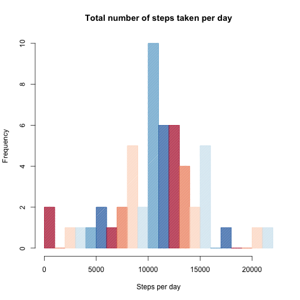
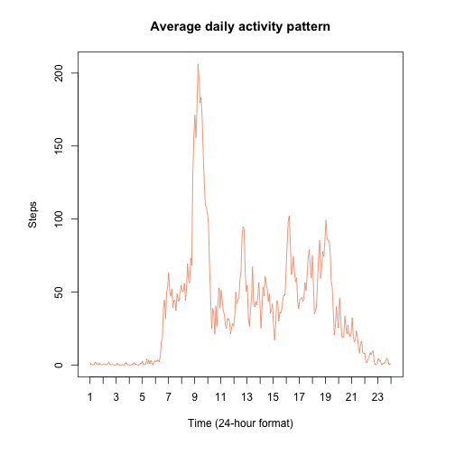
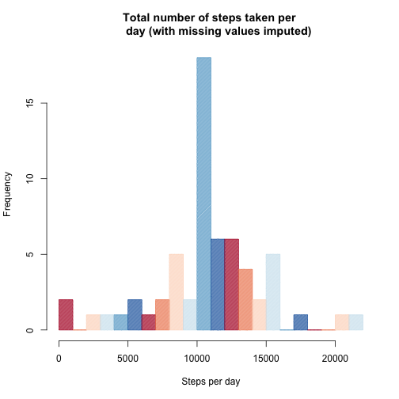
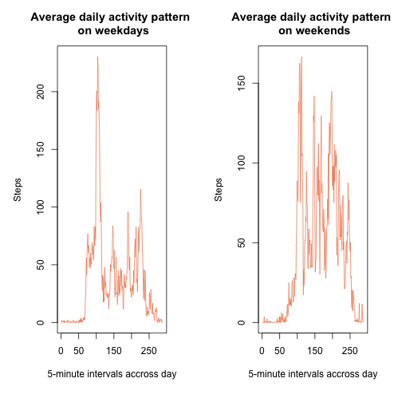

### 1. Code for reading in the dataset and/or processing the data

```r
## load packages
library(RColorBrewer)
## set scientific notation standards
options(scipen=999)
## load and preprocess data
data <- read.csv("activity.csv")
data_noNA <- data[!is.na(data$steps),] ## exclude NA values for 1st part 
```

### 2. Histogram of the total number of steps taken each day

```r
## mean total steps taken per day
steps_day <- as.data.frame(sapply(split(data_noNA$steps, data_noNA$date), sum))
cols <- brewer.pal(n = 6, name = "RdBu")
meanSteps <- mean(steps_day[,1])
medianSteps <- median(steps_day[,1])
hist(steps_day[,1], col = cols, main = "Total number of steps taken per day",
     xlab = "Steps per day", density = 80, breaks =20)
```



### 3. 
a) Mean number of steps taken each day: 10766.1886792
b) Median number of steps taken each day: 10765

### 4. Time series plot of the average number of steps taken

```r
## what is the average daily activity pattern
mean_steps_int <- as.data.frame(sapply(split(data_noNA$steps, data_noNA$interval), mean))
max_int <- unique(data$interval[which.max(mean_steps_int[,1])])
par(mar=c(6, 6, 4, 4))
plot(mean_steps_int[,1], type="l", col=cols[2], 
     main = "Average daily activity pattern", ylab = "Steps", 
     xlab = "Time (24-hour format)", xaxt="n")
axis(1, at=seq(1, nrow(mean_steps_int), len=24), labels=1:24)
```



### 5. The 5-minute interval that, on average, contains the maximum number of steps: 835

### 6. Code to describe and show a strategy for imputing missing data
Strategy: Use average step number for the missing step interval 

```r
## imputing missing values
missing <- sum(is.na(data$steps))
df <- data.frame(intervals = unique(data$interval), meanSteps = mean_steps_int[,1])
copy <- data.frame(data)
for(i in 1:nrow(copy)){
    if (is.na(copy$steps[i])) copy$steps[i] <- df$meanSteps[df$intervals == copy$interval[i]]
}
```

### 7. Histogram of the total number of steps taken each day after missing values are imputed

```r
steps_day_copy <- as.data.frame(sapply(split(copy$steps, copy$date), sum))
meanStepsIM <- mean(steps_day_copy[,1])
medianStepsIM <- median(steps_day_copy[,1])
hist(steps_day_copy[,1], col = cols, main = "Total number of steps taken per 
     day (with missing values imputed)",
     xlab = "Steps per day", density = 80, breaks=20)
```



# 
a) Mean number of steps taken each day (after imputing): 10766.1886792  
b) Median number of steps taken each day (after imputing): 10766.1886792

### 8. Panel plot comparing the average number of steps taken per 5-minute interval across weekdays and weekends

```r
## differences in activity patterns between weekdays and weekends
weekdys <- c("Monday", "Tuesday", "Wednesday", "Thursday", "Friday")
copy$days <- factor(weekdays(as.Date(copy$date)) %in% weekdys, 
                   labels = c("weekend", "weekday"))
copy_day <- copy[copy$days == "weekday", ]
copy_end <- copy[copy$days == "weekend", ]
mean_steps_int_days <- as.data.frame(sapply(split(copy_day$steps, copy_day$interval), mean))
mean_steps_int_ends <- as.data.frame(sapply(split(copy_end$steps, copy_end$interval), mean))
par(mar=c(6, 5, 4, 3), mfrow=c(1,2))

plot(mean_steps_int_days[,1], type="l", col=cols[2], 
     main = "Average daily activity pattern \n on weekdays", ylab = "Steps", 
     xlab = "5-minute intervals accross day")
plot(mean_steps_int_ends[,1], type="l", col=cols[2], 
     main = "Average daily activity pattern \n on weekends", ylab = "Steps", 
     xlab = "5-minute intervals accross day")
```


